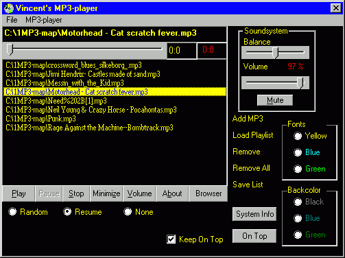



## all functional mp3\-player

### Description

Unlike many others this code really works.

Incorporating all basic mp3-player functions and a lot of handy features.

Includes a minibrowser to search for your favorite mp3-files.
 
### More Info
 
Easy to understand, simple code, great for beginners, uses windows media player and explorer function.

             |
---                |---
**Submitted On**   |2001-04-05 23:28:20
**By**             |[Vincent Blomtrock](https://github.com/Planet-Source-Code/PSCIndex/blob/master/ByAuthor/vincent-blomtrock.md)
**Level**          |Beginner
**User Rating**    |3.8 (23 globes from 6 users)
**Compatibility**  |VB 5\.0, VB 6\.0
**Category**       |[Sound/MP3](https://github.com/Planet-Source-Code/PSCIndex/blob/master/ByCategory/sound-mp3__1-45.md)
**World**          |[Visual Basic](https://github.com/Planet-Source-Code/PSCIndex/blob/master/ByWorld/visual-basic.md)
**Archive File**   |[all functi1846041620\.zip](https://github.com/Planet-Source-Code/vincent-blomtrock-all-functional-mp3-player__1-22465/archive/master.zip)

